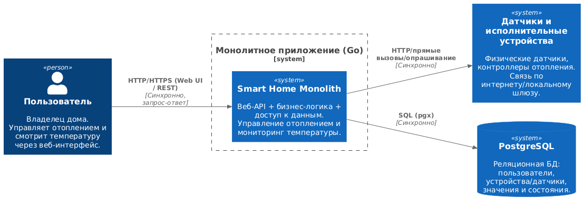
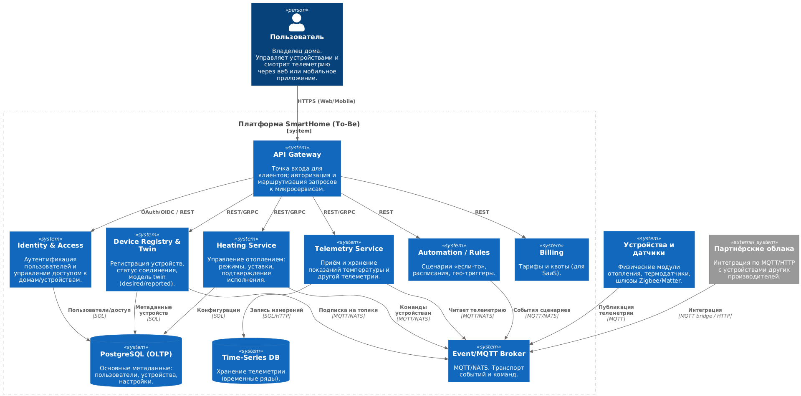
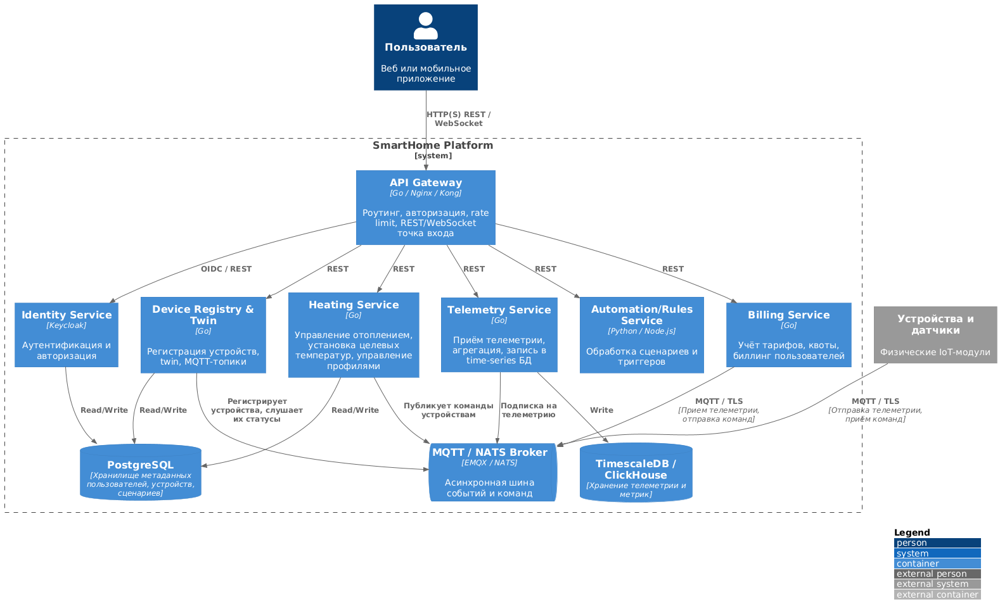
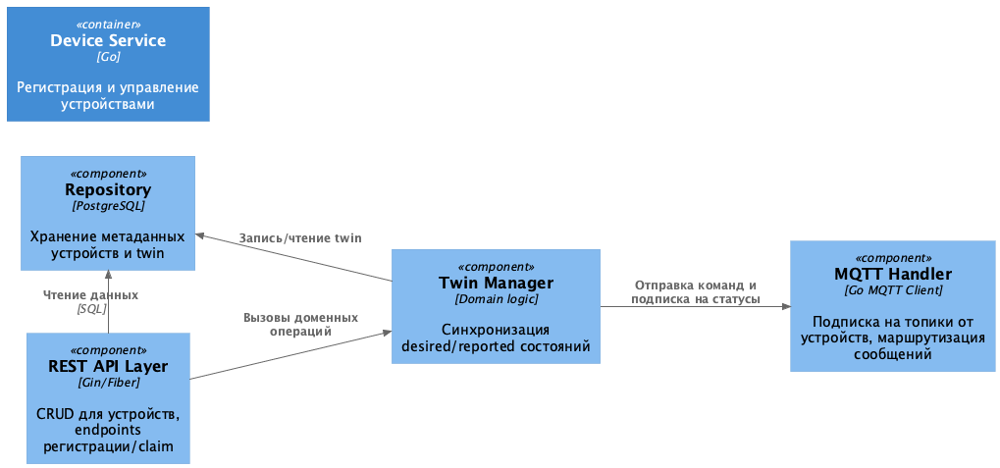
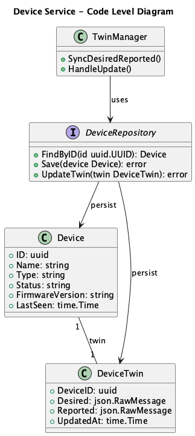
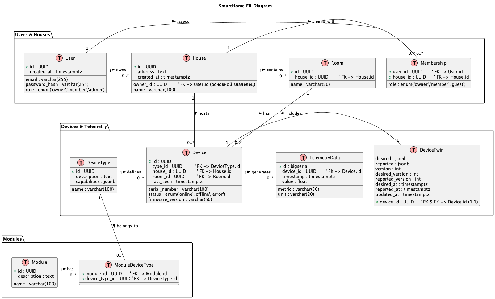

# Project_template

Это шаблон для решения проектной работы. Структура этого файла повторяет структуру заданий. Заполняйте его по мере работы над решением.

# Задание 1. Анализ и планирование

<aside>

Чтобы составить документ с описанием текущей архитектуры приложения, можно часть информации взять из описания компании и условия задания. Это нормально.

</aside>

### 1. Описание функциональности монолитного приложения

**Управление отоплением:**

- Веб-клиент отправляет команды (вкл/выкл, возможно целевая температура). Монолит синхронно проксирует команду к устройству/шлюзу и возвращает ответ.

**Мониторинг температуры:**

- Монолит получает показания датчиков (сейчас — синхронный pull/опрашивание или вызов внешнего «температурного» сервиса-адаптера), сохраняет текущее значение и отдаёт веб-клиенту «текущую температуру» по запросу.

### 2. Анализ архитектуры монолитного приложения

- ЯП: Go.
- БД: PostgreSQL (OLTP, без time-series).
- Топология: один бинарь (веб-сервер, бизнес-логика, доступ к данным).
- Интеграции: синхронные вызовы устройств/адаптеров.
- Масштабируемость: вертикальная; горизонтальное масштабирование ограничено «единством» кода/состояния.
- Развёртывание: перезапуск всего приложения при релизе (даже если меняется малая часть).

### 3. Определение доменов и границы контекстов

- Heating Control (Отопление) — управление режимами отопления, профили/уставки, подтверждение исполнения.
  - Сущности: Heater, HeatingMode, Setpoint, Command, CommandResult.
  - Сейчас: упрощённо.
- Telemetry (Температура/датчики) — приём/нормализация показаний, хранение и выдача текущих значений.
  - Сущности: Sensor, Measurement, MetricStream.
  - Сейчас: присутствует, но в виде синхронного pull.
- Device Management (Управление устройствами) — жизненный цикл устройства, регистрация/привязка к дому, серийники, ключи, статусы подключенности.
  - Сущности: Device, Capability, Firmware.
  - Сейчас: частично/минимально в монолите (как «датчики»).
- Identity & Access (Пользователи/доступ) — учётные записи, роли, доступ к домам/помещениям.
  - Сущности: User, Role, Household/Place, Membership, Session/Token.
  - Сейчас: упрощённо.
- Household & Topology (Дома/помещения) — модель дома, комнаты, зоны отопления, привязки устройств.
  - Сущности: Household, Room, Zone, Assignment.
  - Сейчас: упрощённо.
- Automation/Rules (Сценарии) — правила «если-то», расписания, гео-триггеры.
  - Сущности: Rule, Trigger, Action, Schedule.
  - Сейчас: отсутствует (планируется).
- Observability — метрики/логи/трейсы, алерты по отказам устройств/каналов.
  - Сейчас: нет.
- Billing/Plans (если SaaS) — тарифы, квоты, ограничение функций.
  - Сейчас: нет.


### **4. Проблемы монолитного решения**

Сильные стороны
- Простота разработки и деплоя (одна кодовая база, один конвейер).
- Низкие накладные расходы на коммуникации между слоями (внутрипроцессные вызовы).
- Низкий TTM для узкого набора функций (отопление + температура).

Слабые стороны
- Хрупкость релизов: любая правка = перезапуск всего.
- Ограниченная масштабируемость: нельзя масштабировать только приём телеметрии или только выдачу команд.
- Связность доменов: отопление, датчики, пользователи, устройства и интеграции смешаны; сложнее вводить новые категории (свет/ворота/видео).
- Синхронность: длинные цепочки ожиданий, нет очередей/повторов/идемпотентности для команд и телеметрии.

### 5. Визуализация контекста системы — диаграмма С4

**Рис. 1. Контекстная диаграмма текущего монолита (As-Is).**


**Рис. 2. Контекстная диаграмма проектируемой системы (To-Be).**


# Задание 2. Проектирование микросервисной архитектуры

В этом задании вам нужно предоставить только диаграммы в модели C4. Мы не просим вас отдельно описывать получившиеся микросервисы и то, как вы определили взаимодействия между компонентами To-Be системы. Если вы правильно подготовите диаграммы C4, они и так это покажут.

**Рис. 3. Диаграмма контейнеров (To-Be)**



**Рис. 4. Диаграмма компонентов (To-Be)**



**Рис. 5. Диаграмма кода (To-Be)**



# Задание 3. Разработка ER-диаграммы

Добавьте сюда ER-диаграмму. Она должна отражать ключевые сущности системы, их атрибуты и тип связей между ними.
**Рис. 6. ER-диаграмма (To-Be)**



# Задание 4. Создание и документирование API

### 1. Тип API

1. **REST (HTTP/JSON, OpenAPI 3.1)** — [для синхронных операций и чтений](docs/images/Event-Flow-Twin-Conflict.png)
    - Внешние клиенты и «медленные» S2S: CRUD устройств/домов/пользователей, чтение твина, агрегации телеметрии, постановка команд «по кнопке».
    - Контракты версионируем по URL (`/api/v1/...`) и схемам (semantic versioning).
    - Конфликты/идемпотентность — `ETag/If-Match` (версионирование Twin), `202 Accepted` для команд с асинхронной конвергенцией.

2. **Событийная шина (MQTT/NATS, AsyncAPI 2.6)** — [для асинхронного обмена](docs/images/Event-Flow-Telemetry-Rule-Twin.png)
    - Инжест телеметрии, публикация `desired/delta` твина, доменные события (`device.online`, `command.ack`, `rule.fired`).
    - Топики версионируем префиксом: `v1/devices/{id}/twin/...`, `v1/telemetry/{deviceId}`.
    - Идемпотентность по `messageId`/версии твина; QoS1/2 и retained-сообщения для устойчивости.

3. **gRPC (Protobuf, опционально для внутреннего S2S)** — для «горячих» путей
    - Низкая латентность между сервисами.
    - .proto в `schemas/grpc/` (введём при необходимости).

### 2. Документация API

1. **[Открыть страницу OpenAPI](./docs/api/openapi/openapi.html)**
2. **[Открыть страницу AsyncAPI](./docs/api/asyncapi/index.html)**

# Задание 5. Работа с docker и docker-compose

Перейдите в apps.

Там находится приложение-монолит для работы с датчиками температуры. В README.md описано как запустить решение.

Вам нужно:

1) сделать простое приложение temperature-api на любом удобном для вас языке программирования, которое при запросе /temperature?location= будет отдавать рандомное значение температуры.

Locations - название комнаты, sensorId - идентификатор названия комнаты

```
	// If no location is provided, use a default based on sensor ID
	if location == "" {
		switch sensorID {
		case "1":
			location = "Living Room"
		case "2":
			location = "Bedroom"
		case "3":
			location = "Kitchen"
		default:
			location = "Unknown"
		}
	}

	// If no sensor ID is provided, generate one based on location
	if sensorID == "" {
		switch location {
		case "Living Room":
			sensorID = "1"
		case "Bedroom":
			sensorID = "2"
		case "Kitchen":
			sensorID = "3"
		default:
			sensorID = "0"
		}
	}
```

2) Приложение следует упаковать в Docker и добавить в docker-compose. Порт по умолчанию должен быть 8081

3) Кроме того для smart_home приложения требуется база данных - добавьте в docker-compose файл настройки для запуска postgres с указанием скрипта инициализации ./smart_home/init.sql

Для проверки можно использовать Postman коллекцию smarthome-api.postman_collection.json и вызвать:

- Create Sensor
- Get All Sensors

Должно при каждом вызове отображаться разное значение температуры

Ревьюер будет проверять точно так же.


# **Задание 6. Разработка MVP**

Необходимо создать новые микросервисы и обеспечить их интеграции с существующим монолитом для плавного перехода к микросервисной архитектуре. 

### **Что нужно сделать**

1. Создайте новые микросервисы для управления телеметрией и устройствами (с простейшей логикой), которые будут интегрированы с существующим монолитным приложением. Каждый микросервис на своем ООП языке.
2. Обеспечьте взаимодействие между микросервисами и монолитом (при желании с помощью брокера сообщений), чтобы постепенно перенести функциональность из монолита в микросервисы. 

В результате у вас должны быть созданы Dockerfiles и docker-compose для запуска микросервисов. 